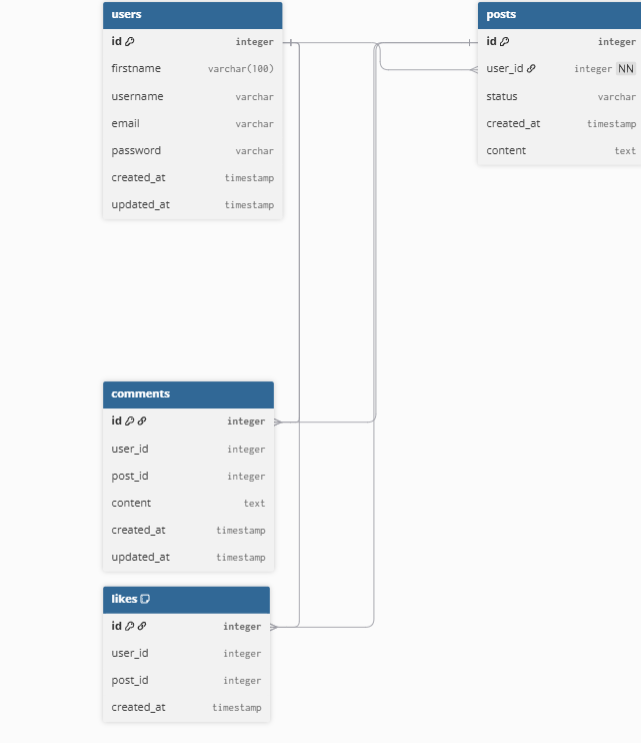

# ConnectIn

ConnectIn est un mini réseau social réalisé dans le cadre du projet W-WEB-103.

Le but du projet est de créer une plateforme simple où les utilisateurs peuvent publier des posts, commenter et liker des publications.

---

## Fonctionnalités

- Authentification des utilisateurs
- Création de posts
- Commentaires sur les posts
- Likes sur les posts
- Upload d’images
- Affichage d’un feed avec toutes les publications

---

## Architecture du projet

Le projet est séparé en deux parties :

### Backend

Situé dans /backend.

Le backend est développé avec *Laravel* et expose une API qui gère :

- les utilisateurs
- les posts
- les commentaires
- les likes
- les images

### Frontend

Situé dans /frontend.

Le frontend communique avec l’API du backend pour afficher le feed et permettre les interactions des utilisateurs.

---

## Base de données

La base de données contient les tables suivantes :

- users
- posts
- comments
- likes

### Diagramme de la base de données

---

## Technologies utilisées

- PHP
- Laravel
- MySQL
- JavaScript
- Docker

---

## Lancer le projet

Cloner le repository :

### API endpoints

POST /api/register
POST /api/login

GET /api/posts
POST /api/posts
DELETE /api/posts/{id}

POST /api/comments
DELETE /api/comments/{id}

POST /api/likes
DELETE /api/likes/{id}